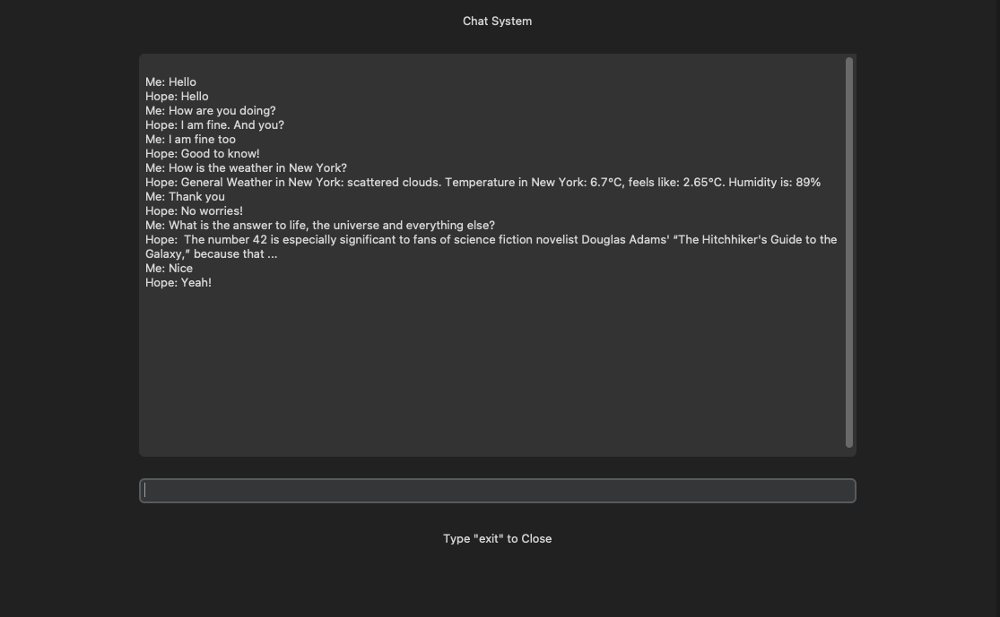

# Tensorflow intent-based Chatbot - Hope

**Authors: Laura-Marie Behmenburg, Fabian van Treek**

The Inspration for the Cahtbot was taken by this [Video](https://www.youtube.com/watch?v=1lwddP0KUEg) and [The Basics of building an Artificial Intelligence Chatbot – 2023](https://www.mygreatlearning.com/blog/basics-of-building-an-artificial-intelligence-chatbot/).
These ideas were used as a basic structure and expanded and adapted with our own features.

If you are interested in the programm structure and how things work, you can look [here](Developer.md).

## Installation
The Chatbot mainly based on python.
### Requirements
Create a conda environment and install the necessary dependencies.
  ```
  conda create --name chatbot python=3.8
  conda activate chatbot

  pip install spacy
  python -m spacy download en_core_web_lg
  pip install tensorflow
  pip install wikipedia-api
  pip install googleapi
  pip install customtkinter

  ```
## Data
The Chatbot Data, based largely on the file [intents_hope.json](data/intents_hope.json) this file, was merged by hand, by some datasets found on the Internet. In addition, further content was added or changed manually.
- [Recognition-dataset from Kaggle](https://www.kaggle.com/datasets/elvinagammed/chatbots-intent-recognition-dataset/code)
- [intents-for-first-aid-recommendations from Kaggle](https://www.kaggle.com/datasets/therealsampat/intents-for-first-aid-recommendations)
- [mental-health-conversational-data from Kaggle](https://www.kaggle.com/datasets/elvis23/mental-health-conversational-data)
- [Intens from Kaggle](https://www.kaggle.com/datasets/chachiawacef/intents)


## Usage
### Train the Bot
Start the following file to start the training:

```
python training_hope.py
```
Training must be done once, but if some changes happen to the **intents_hope.json**, by adding new Patterns or changing them. <br> The Bot must be trained again, otherwise the bot does not take over the new changes.
### Start the Bot
Start the following file to start the Bot:

```
python chatting_hope.py
```
After starting the Bot the Console should look like this:
```
Bot is running!
Me:
```
Now the bot is running and you can talk with him.

#### <b>run_gui_hope.py</b>
This file will start the bot with a simple gui, where the user can enter his input within a textfield. <br>
The user-input and the bot-response will be printed on the screen. 
```
python run_gui_hope.py
```



